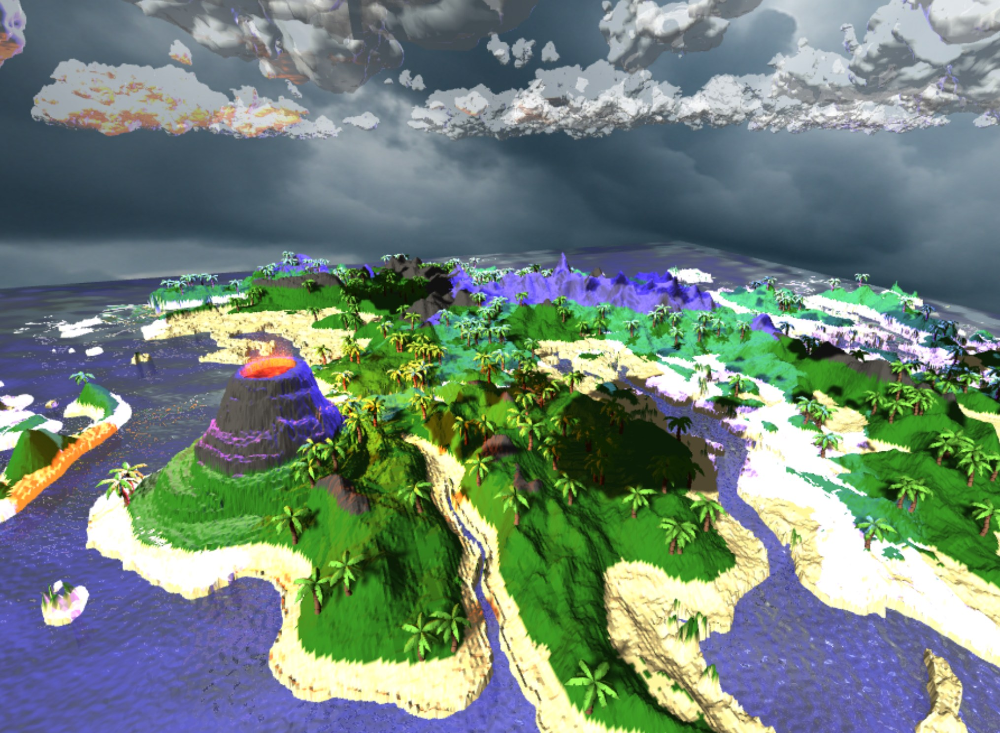

# Wind and Rain‑Swept Forest Scene (Three.js)

A real‑time WebGL demo that combines procedural terrain, dynamic weather, day–night lighting, water shaders, and physics‑driven lava eruptions—all running in the browser with **Three.js** and **Cannon‑es**.

---

## ✨ Features

* **CPU‑displaced terrain** from a height‑map, vertex‑colored into sand / grass / rock biomes.
* **Water surface** with reflection, refraction, animated normals, adjustable in GUI.
* **Skydome + orbiting sun** that transitions daylight → dusk with soft shadows.
* **Weather system**
  • Wind‑swaying trees (per‑instance offset)
  • Toggleable rain particle system
  • Random lightning flashes with area bounds.
* **Volcano & lava pool**
  • GPU particle‑fire plume
  • Clickable lava that ejects glowing Cannon bodies.
* **dat.GUI** panel to tweak terrain resolution, colors, wind, water, lightning, helpers, etc.

---

## ⌨️ Controls

| Input             | Effect                                                          |
| ----------------- | --------------------------------------------------------------- |
| Mouse drag        | Orbit camera                                                    |
| Scroll wheel      | Zoom in/out                                                     |
| **W / A / S / D** | Pan (OrbitControls key mapping)                                 |
| Click lava pool   | Eject lava spheres                                              |
| dat.GUI sliders   | Toggle rain, helpers, lightning; adjust wind, water, sun speed… |

